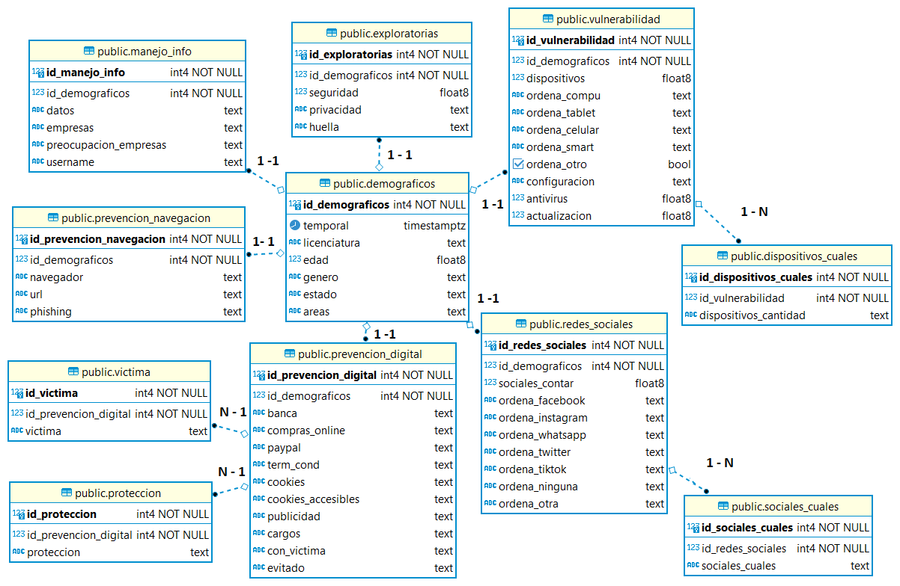

```{r setup, include=FALSE}
knitr::opts_chunk$set(echo = FALSE)
```

## Modelo ER

{width="100%"}

## Scripts

### Creación de objetos

- [Script](https://github.com/FerLango/Proyecto-db/blob/main/Sql/Create.sql)

### Inserción de datos

- [Script](https://github.com/FerLango/Proyecto-db/blob/main/Limpieza/clean.R)

### Borrado de datos

- [Script](https://github.com/FerLango/Proyecto-db/blob/main/Sql/Delete_data.sql)

### Eliminación de objetos

- [Script](https://github.com/FerLango/Proyecto-db/blob/main/Sql/Drop_objects.sql)
